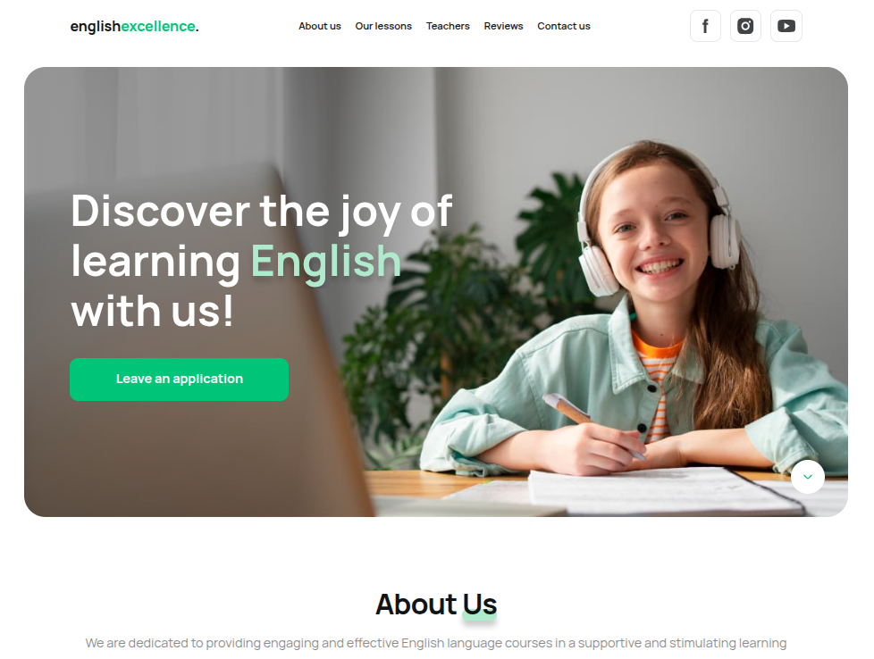
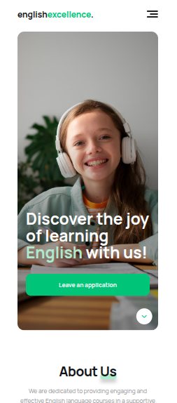

# 🎓 Проєкт "English Excellence"

**English Excellence** — адаптивний вебсайт школи англійської мови, створений
студентами GoIT Neoversity у рамках колаборації з Woolf University на програмі
**Master of Science in Software Engineering**.

Мета проєкту — продемонструвати навички семантичної верстки, адаптивного дизайну
та інтеграції сучасних інструментів фронтенд-розробки.

---

## 👥 Команда розробників

- [Тарас Чайківський](https://github.com/tchaikivskyi) — team lead
- [Дарина Лисенко](https://github.com/Darymee) — scrum master
- [Микола Майоров](https://github.com/mykolamayorov) — developer
- [Артем Терзі](https://github.com/ArtemTerzi) — developer
- [Віктор Бондаренко](https://github.com/ViktorBond7) — developer
- [Юлія Ліпатова](https://github.com/juliyalip) — developer
- [Олексій Матвійчук](https://github.com/AlexDvor) — developer
- [Василь Куцар](https://github.com/kutsarvasya) — developer

---

## 🛠 Використані технології

- **HTML5** — семантична розмітка
- **CSS3** — адаптивна стилізація (3 брейкпоінти: 375px, 768px, 1280px)
- **JavaScript (ES Modules)** — інтерактивність та анімації
- **[modern-normalize](https://github.com/sindresorhus/modern-normalize)** —
  уніфікація стилів
- **[Google Fonts](https://fonts.google.com/specimen/Manrope)** — шрифт
  _Manrope_
- **[Swiper.js](https://swiperjs.com/)** — слайдер для відгуків
- **Vite** — швидкий збирач та локальний сервер

---

## 📌 Виконані вимоги

- ✅ Семантична верстка з трьома переломами (mobile / tablet / desktop)
- ✅ Оптимізовані зображення у `src/images` (включно з Retina)
- ✅ Підключені modern-normalize та Google Fonts
- ✅ Оптимізоване завантаження зображень та favicon
- ✅ HTML та CSS пройшли перевірку на [W3C Validator](https://validator.w3.org/)
  та [CSS Validator](https://jigsaw.w3.org/css-validator/) — без помилок
- ✅ Оцінка [PageSpeed Insights](https://pagespeed.web.dev/) — не нижче **70**
- ✅ Відсутність помилок у консолі браузера
- ✅ Дотримано правила іменування файлів (без пробілів, лише малі англійські
  літери)
- ✅ Фінальна версія задеплоєна на **GitHub Pages**
- ✅ Паршали стилів у `src/css`, імпортовані в `main.css`
- ✅ HTML-паршали у `src/partials` підключені до `index.html` через тег `<load>`

---

 


## 🚀 Як запустити проєкт локально

1. Клонувати репозиторій:

   ```bash
   git clone https://github.com/Darymee/english-excellence
   ```

2. Перейти у папку проєкту:

   ```bash
   cd english-excellence
   ```

3. Встановити залежності:

   ```bash
   git clone https://github.com/Darymee/english-excellence
   ```

4. Запустити локальний сервер:

   ```bash
   npm run dev
   ```

5. Відкрити у браузері:
   ```bash
   http://localhost:5173
   ```
